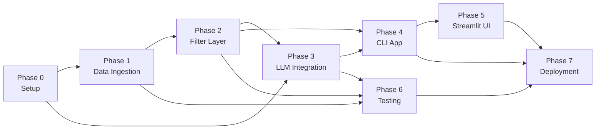

# Implementation Plan
## AI-Powered Restaurant Recommendation System (Zomato Use Case)

---

## Table of Contents

1. [Overview](#1-overview)
2. [Phase 0 — Project Setup & Environment](#phase-0--project-setup--environment)
3. [Phase 1 — Data Ingestion & Preprocessing](#phase-1--data-ingestion--preprocessing)
4. [Phase 2 — Filtering & Integration Layer](#phase-2--filtering--integration-layer)
5. [Phase 3 — LLM Integration & Prompt Engineering](#phase-3--llm-integration--prompt-engineering)
6. [Phase 4 — CLI Application (End-to-End)](#phase-4--cli-application-end-to-end)
7. [Phase 5 — Streamlit Web UI](#phase-5--streamlit-web-ui)
8. [Phase 6 — Testing & Quality Assurance](#phase-6--testing--quality-assurance)
9. [Phase 7 — Polish, Docs & Deployment](#phase-7--polish-docs--deployment)
10. [Timeline Summary](#10-timeline-summary)
11. [Dependencies Map](#11-dependencies-map)

---

## 1. Overview

This implementation plan breaks the project into **7 phases**, ordered so that each phase builds on the last. The core working product (CLI) is complete by Phase 4; Phases 5–7 add the web UI, tests, and production readiness.

| Phase | Goal | Output |
|---|---|---|
| **Phase 0** | Setup project scaffold & environment | Folder structure, `.env`, `requirements.txt` |
| **Phase 1** | Load & preprocess Zomato dataset | `ingest.py`, `data/restaurants.csv` |
| **Phase 2** | Filter & rank restaurants by user input | `filter.py` |
| **Phase 3** | Build LLM prompt & integrate API | `prompt_builder.py`, `llm_client.py` |
| **Phase 4** | Wire everything into a working CLI app | `main.py`, `output_formatter.py` |
| **Phase 5** | Build Streamlit web UI | `app/streamlit_app.py` |
| **Phase 6** | Write tests & fix edge cases | `tests/` |
| **Phase 7** | Final polish, README, deployment | `README.md`, Docker / cloud deploy |

---

## Phase 0 — Project Setup & Environment

**Goal:** Create the project skeleton, install dependencies, and configure secrets.

### Steps

#### 0.1 — Create Directory Structure
```
project-root/
├── docs/
├── data/
├── src/
├── app/
├── tests/
├── .env
├── .env.example
├── requirements.txt
└── README.md
```

Run:
```bash
mkdir -p docs data src app tests
touch src/__init__.py tests/__init__.py
touch .env .env.example requirements.txt README.md
```

#### 0.2 — Create `requirements.txt`
```txt
datasets>=2.19.0
pandas>=2.0.0
google-generativeai>=0.7.0
openai>=1.30.0
anthropic>=0.28.0
groq>=0.5.0
python-dotenv>=1.0.0
streamlit>=1.35.0
pytest>=8.0.0
```

Install:
```bash
pip install -r requirements.txt
```

#### 0.3 — Configure `.env`
```env
# Choose ONE provider
LLM_PROVIDER=groq          # gemini | openai | anthropic | groq
LLM_MODEL=openai/gpt-oss-120b # For Groq: openai/gpt-oss-120b or qwen/qwen3.6-27b

# API Keys (fill in only the one you use)
GEMINI_API_KEY=your_key_here
OPENAI_API_KEY=your_key_here
ANTHROPIC_API_KEY=your_key_here
GROQ_API_KEY=your_key_here

# LLM Settings
LLM_TEMPERATURE=0.7
LLM_MAX_TOKENS=1024
TOP_N_RESULTS=10
```

#### 0.4 — Create `.env.example`
Copy `.env` with all values blanked out — safe to commit to version control.

### ✅ Phase 0 Checklist
- [ ] Folder structure created
- [ ] `requirements.txt` written and installed
- [ ] `.env` configured with API key
- [ ] `.env.example` committed to repo

---

## Phase 1 — Data Ingestion & Preprocessing

**Goal:** Load the Zomato dataset from Hugging Face, clean it, and save a preprocessed CSV locally.

**File:** `src/ingest.py`

### Steps

#### 1.1 — Load Dataset from Hugging Face
```python
from datasets import load_dataset

def load_raw_dataset():
    dataset = load_dataset("ManikaSaini/zomato-restaurant-recommendation", split="train")
    df = dataset.to_pandas()
    return df
```

#### 1.2 — Explore & Identify Fields
Print column names and data types. Identify:
- `name` — restaurant name
- `location` — city/area
- `cuisines` — comma-separated string
- `approx_cost(for two people)` — cost string (e.g. "800")
- `aggregate_rating` — float (e.g. 4.2)
- `votes` — int
- `rest_type` — restaurant category

#### 1.3 — Clean & Normalize
```python
def preprocess(df):
    # Select relevant columns
    df = df[['name', 'location', 'cuisines', 'approx_cost(for two people)',
             'aggregate_rating', 'votes', 'rest_type']].copy()

    # Rename for ease of use
    df.rename(columns={'approx_cost(for two people)': 'cost'}, inplace=True)

    # Clean cost column (remove commas, cast to int)
    df['cost'] = df['cost'].astype(str).str.replace(',', '').str.strip()
    df['cost'] = pd.to_numeric(df['cost'], errors='coerce').fillna(0).astype(int)

    # Normalize text columns
    df['location']  = df['location'].str.lower().str.strip()
    df['cuisines']  = df['cuisines'].str.lower().str.strip()
    df['rest_type'] = df['rest_type'].str.lower().str.strip()

    # Handle missing ratings
    df['aggregate_rating'] = pd.to_numeric(df['aggregate_rating'], errors='coerce').fillna(0.0)
    df['votes'] = pd.to_numeric(df['votes'], errors='coerce').fillna(0).astype(int)

    # Drop rows with no name or location
    df.dropna(subset=['name', 'location'], inplace=True)
    df.reset_index(drop=True, inplace=True)

    return df
```

#### 1.4 — Save Preprocessed CSV
```python
def save_csv(df, path="data/restaurants.csv"):
    df.to_csv(path, index=False)
    print(f"Saved {len(df)} restaurants to {path}")
```

#### 1.5 — Entry Point
```python
if __name__ == "__main__":
    df = load_raw_dataset()
    df = preprocess(df)
    save_csv(df)
```

Run once:
```bash
python src/ingest.py
```

### ✅ Phase 1 Checklist
- [ ] Dataset loads successfully from Hugging Face
- [ ] All columns cleaned and normalized
- [ ] Missing values handled
- [ ] `data/restaurants.csv` generated (~51,000 rows)
- [ ] Script is idempotent (safe to re-run)

---

## Phase 2 — Filtering & Integration Layer

**Goal:** Accept user preferences, filter the dataset, and return a ranked shortlist for the LLM.

**File:** `src/filter.py`

### Steps

#### 2.1 — Define Budget Mapping
```python
BUDGET_MAP = {
    "low":    (0,    500),
    "medium": (500,  1500),
    "high":   (1500, 99999),
}
```

#### 2.2 — Parse User Input
```python
def parse_input(location, budget, cuisine, min_rating, extras=""):
    budget = budget.lower().strip()
    cost_min, cost_max = BUDGET_MAP.get(budget, (0, 99999))
    return {
        "location":   location.lower().strip(),
        "cuisine":    cuisine.lower().strip(),
        "cost_min":   cost_min,
        "cost_max":   cost_max,
        "min_rating": float(min_rating),
        "extras":     extras.strip(),
        "budget_label": budget,
    }
```

#### 2.3 — Filter DataFrame
```python
import pandas as pd

def filter_restaurants(df, user_prefs, top_n=10):
    filtered = df[
        df['location'].str.contains(user_prefs['location'], na=False) &
        df['cuisines'].str.contains(user_prefs['cuisine'], na=False) &
        (df['cost'] >= user_prefs['cost_min']) &
        (df['cost'] <= user_prefs['cost_max']) &
        (df['aggregate_rating'] >= user_prefs['min_rating'])
    ]

    # Sort: highest rating first, then most votes
    filtered = filtered.sort_values(
        by=['aggregate_rating', 'votes'], ascending=False
    )

    return filtered.head(top_n).reset_index(drop=True)
```

#### 2.4 — Serialize for Prompt
```python
def serialize_restaurants(df):
    lines = []
    for i, row in df.iterrows():
        lines.append(
            f"{i+1}. {row['name']} | Location: {row['location']} | "
            f"Cuisine: {row['cuisines']} | Cost: Rs.{row['cost']} for two | "
            f"Rating: {row['aggregate_rating']} | Type: {row['rest_type']}"
        )
    return "\n".join(lines)
```

### ✅ Phase 2 Checklist
- [ ] Budget mapping works correctly for all 3 tiers
- [ ] Partial location matching (e.g. "delhi" matches "new delhi")
- [ ] Cuisine partial match (e.g. "indian" matches "north indian, mughlai")
- [ ] Falls back gracefully when no results match (returns empty, shows helpful message)
- [ ] Serialized output is readable and clean

---

## Phase 3 — LLM Integration & Prompt Engineering

**Goal:** Build the prompt, call the LLM API, and return the raw recommendation text.

**Files:** `src/prompt_builder.py`, `src/llm_client.py`

### Steps

#### 3.1 — Build the Prompt (`prompt_builder.py`)
```python
SYSTEM_PROMPT = """
You are an expert restaurant recommendation assistant.
Your job is to analyze a list of restaurants and the user preferences,
then recommend the top 3-5 restaurants with clear, friendly explanations
for why each one is a great match. Be specific and helpful.
"""

def build_user_prompt(user_prefs, restaurant_data):
    cost_range = f"Rs.{user_prefs['cost_min']}–Rs.{user_prefs['cost_max']}"
    return f"""
User Preferences:
- Location     : {user_prefs['location']}
- Budget       : {user_prefs['budget_label']} (approx. {cost_range} for two)
- Cuisine      : {user_prefs['cuisine']}
- Min Rating   : {user_prefs['min_rating']}
- Other        : {user_prefs.get('extras', 'None')}

Here are the top matching restaurants from our database:

{restaurant_data}

Please rank the top 3-5 restaurants from this list and explain
why each one is a great fit for the user. Format your response as:

1. **Restaurant Name**
   - Cuisine: ...
   - Rating: ...
   - Cost: ...
   - Why this?: ...
"""
```

#### 3.2 — LLM Client (`llm_client.py`)
```python
import os
from dotenv import load_dotenv
load_dotenv()

PROVIDER    = os.getenv("LLM_PROVIDER", "gemini")
TEMPERATURE = float(os.getenv("LLM_TEMPERATURE", 0.7))
MAX_TOKENS  = int(os.getenv("LLM_MAX_TOKENS", 1024))

def get_recommendation(system_prompt, user_prompt):
    if PROVIDER == "gemini":
        return _call_gemini(system_prompt, user_prompt)
    elif PROVIDER == "openai":
        return _call_openai(system_prompt, user_prompt)
    elif PROVIDER == "anthropic":
        return _call_anthropic(system_prompt, user_prompt)
    elif PROVIDER == "groq":
        return _call_groq(system_prompt, user_prompt)
    else:
        raise ValueError(f"Unknown LLM_PROVIDER: {PROVIDER}")
```

#### 3.3 — Gemini Implementation
```python
import google.generativeai as genai

def _call_gemini(system_prompt, user_prompt):
    genai.configure(api_key=os.getenv("GEMINI_API_KEY"))
    model = genai.GenerativeModel(
        model_name="gemini-1.5-pro",
        system_instruction=system_prompt,
        generation_config={"temperature": TEMPERATURE, "max_output_tokens": MAX_TOKENS}
    )
    response = model.generate_content(user_prompt)
    return response.text
```

#### 3.4 — OpenAI Implementation
```python
from openai import OpenAI

def _call_openai(system_prompt, user_prompt):
    client = OpenAI(api_key=os.getenv("OPENAI_API_KEY"))
    response = client.chat.completions.create(
        model="gpt-4o",
        messages=[
            {"role": "system", "content": system_prompt},
            {"role": "user",   "content": user_prompt},
        ],
        temperature=TEMPERATURE,
        max_tokens=MAX_TOKENS,
    )
    return response.choices[0].message.content
```

#### 3.5 — Anthropic Implementation
```python
import anthropic

def _call_anthropic(system_prompt, user_prompt):
    client = anthropic.Anthropic(api_key=os.getenv("ANTHROPIC_API_KEY"))
    message = client.messages.create(
        model="claude-3-5-sonnet-20241022",
        max_tokens=MAX_TOKENS,
        system=system_prompt,
        messages=[{"role": "user", "content": user_prompt}],
    )
    return message.content[0].text
```

#### 3.6 — Groq Implementation
```python
from groq import Groq

def _call_groq(system_prompt, user_prompt):
    client = Groq(api_key=os.getenv("GROQ_API_KEY"))
    model = os.getenv("LLM_MODEL", "openai/gpt-oss-120b")
    response = client.chat.completions.create(
        model=model,
        messages=[
            {"role": "system", "content": system_prompt},
            {"role": "user", "content": user_prompt}
        ],
        temperature=TEMPERATURE,
        max_tokens=MAX_TOKENS,
    )
    return response.choices[0].message.content
```

### ✅ Phase 3 Checklist
- [ ] Prompt clearly conveys user preferences and restaurant data
- [ ] Gemini provider works end-to-end
- [ ] OpenAI provider works end-to-end
- [ ] Anthropic provider works end-to-end
- [ ] Provider swappable via `.env` without code changes
- [ ] API errors caught and surfaced with helpful messages

---

## Phase 4 — CLI Application (End-to-End)

**Goal:** Wire all components into a single runnable CLI app.

**Files:** `src/main.py`, `src/output_formatter.py`

### Steps

#### 4.1 — Output Formatter (`output_formatter.py`)
```python
def display_recommendations(llm_response):
    print("\n" + "="*60)
    print("   TOP RESTAURANT RECOMMENDATIONS FOR YOU")
    print("="*60)
    print(llm_response)
    print("="*60 + "\n")
```

#### 4.2 — Main CLI Entry Point (`main.py`)
```python
import pandas as pd
from src.filter import parse_input, filter_restaurants, serialize_restaurants
from src.prompt_builder import SYSTEM_PROMPT, build_user_prompt
from src.llm_client import get_recommendation
from src.output_formatter import display_recommendations

def main():
    print("\n Welcome to the AI Restaurant Recommender!\n")

    location   = input("Enter your location        : ")
    budget     = input("Budget (low/medium/high)   : ")
    cuisine    = input("Preferred cuisine          : ")
    min_rating = input("Minimum rating (e.g. 4.0)  : ")
    extras     = input("Any other preferences      : ")

    print("\nSearching restaurants...")
    df = pd.read_csv("data/restaurants.csv")
    user_prefs = parse_input(location, budget, cuisine, min_rating, extras)
    filtered   = filter_restaurants(df, user_prefs)

    if filtered.empty:
        print("No restaurants found matching your criteria. Try broadening your search.")
        return

    print(f"Found {len(filtered)} matching restaurants. Asking AI to rank them...\n")

    restaurant_data = serialize_restaurants(filtered)
    user_prompt     = build_user_prompt(user_prefs, restaurant_data)
    response        = get_recommendation(SYSTEM_PROMPT, user_prompt)

    display_recommendations(response)

if __name__ == "__main__":
    main()
```

Run:
```bash
python src/main.py
```

### ✅ Phase 4 Checklist
- [ ] Full end-to-end flow works from CLI input to LLM output
- [ ] "No results" edge case handled gracefully
- [ ] Response displays cleanly in terminal
- [ ] Tested with at least 3 different user inputs

---

## Phase 5 — Streamlit Web UI

**Goal:** Build an interactive web app wrapping the same backend logic.

**File:** `app/streamlit_app.py`

### Steps

#### 5.1 — UI Layout
```python
import streamlit as st
import pandas as pd
from src.filter import parse_input, filter_restaurants, serialize_restaurants
from src.prompt_builder import SYSTEM_PROMPT, build_user_prompt
from src.llm_client import get_recommendation

st.set_page_config(page_title="AI Restaurant Recommender", page_icon="🍽️")
st.title("🍽️ AI-Powered Restaurant Recommender")
st.caption("Powered by Zomato data + LLM intelligence")
```

#### 5.2 — Sidebar Input Form
```python
with st.sidebar:
    st.header("Your Preferences")
    location   = st.selectbox("City / Location", ["Delhi", "Bangalore", "Mumbai", "Chennai"])
    budget     = st.select_slider("Budget", options=["low", "medium", "high"])
    cuisine    = st.text_input("Preferred Cuisine", placeholder="e.g. Italian, Chinese")
    min_rating = st.slider("Minimum Rating", 0.0, 5.0, 4.0, step=0.1)
    extras     = st.text_area("Any other preferences?", placeholder="e.g. family-friendly, rooftop")
    submit     = st.button("Get Recommendations 🚀")
```

#### 5.3 — Results Display
```python
if submit:
    df = pd.read_csv("data/restaurants.csv")
    user_prefs = parse_input(location, budget, cuisine, min_rating, extras)
    filtered   = filter_restaurants(df, user_prefs)

    if filtered.empty:
        st.warning("No restaurants found. Try different filters.")
    else:
        with st.spinner("Asking AI for the best picks..."):
            restaurant_data = serialize_restaurants(filtered)
            user_prompt     = build_user_prompt(user_prefs, restaurant_data)
            response        = get_recommendation(SYSTEM_PROMPT, user_prompt)

        st.success("Here are your top recommendations!")
        st.markdown(response)
```

Run:
```bash
streamlit run app/streamlit_app.py
```

### ✅ Phase 5 Checklist
- [ ] Web app launches without errors
- [ ] All input fields work correctly
- [ ] Spinner shows during LLM call
- [ ] Results render as formatted markdown
- [ ] "No results" warning shows correctly

---

## Phase 6 — Testing & Quality Assurance

**Goal:** Write unit tests for each component to ensure correctness and prevent regressions.

**Files:** `tests/test_ingest.py`, `tests/test_filter.py`, `tests/test_prompt_builder.py`, `tests/test_llm_client.py`

### Test Cases

#### `tests/test_ingest.py`
| Test | What it checks |
|---|---|
| `test_load_returns_dataframe` | Dataset loads as a non-empty DataFrame |
| `test_cost_is_numeric` | `cost` column is integer after preprocessing |
| `test_no_null_names` | `name` column has no null values |
| `test_rating_in_range` | All ratings are between 0.0 and 5.0 |

#### `tests/test_filter.py`
| Test | What it checks |
|---|---|
| `test_location_filter` | Only restaurants in correct city returned |
| `test_budget_low` | `cost` <= 500 for all results |
| `test_budget_medium` | `cost` 500–1500 for all results |
| `test_cuisine_filter` | Cuisine column contains user's preference |
| `test_rating_filter` | All results have rating >= min_rating |
| `test_empty_result` | Empty DataFrame returned when no match |
| `test_top_n_limit` | Never returns more than top_n results |

#### `tests/test_prompt_builder.py`
| Test | What it checks |
|---|---|
| `test_prompt_contains_location` | Location appears in built prompt |
| `test_prompt_contains_budget` | Budget range appears in built prompt |
| `test_prompt_contains_restaurants` | Restaurant data block is included |
| `test_system_prompt_not_empty` | System prompt is a non-empty string |

#### `tests/test_llm_client.py`
| Test | What it checks |
|---|---|
| `test_invalid_provider_raises` | ValueError raised for unknown provider |
| `test_gemini_returns_string` | (integration) Gemini API returns string |

Run all tests:
```bash
pytest tests/ -v
```

### ✅ Phase 6 Checklist
- [ ] All unit tests pass
- [ ] Edge cases (empty results, bad input) covered
- [ ] No hardcoded API keys in test files

---

## Phase 7 — Polish, Docs & Deployment

**Goal:** Make the project production-ready with documentation and optional deployment.

### Steps

#### 7.1 — README.md
Write a full README with:
- Project description
- Setup instructions
- How to run (CLI + Streamlit)
- `.env` configuration guide
- Example output screenshot

#### 7.2 — Code Quality
```bash
# Format code
pip install black
black src/ app/ tests/

# Lint
pip install flake8
flake8 src/ app/ tests/
```

#### 7.3 — Add `.gitignore`
```gitignore
.env
data/
__pycache__/
*.pyc
.pytest_cache/
```

#### 7.4 — Optional: Dockerize
```dockerfile
FROM python:3.11-slim
WORKDIR /app
COPY requirements.txt .
RUN pip install -r requirements.txt
COPY . .
CMD ["streamlit", "run", "app/streamlit_app.py", "--server.port=8501"]
```

#### 7.5 — Optional: Deploy to Streamlit Cloud
1. Push to GitHub
2. Go to [share.streamlit.io](https://share.streamlit.io)
3. Connect repo and set secrets in the dashboard

### ✅ Phase 7 Checklist
- [ ] README.md complete with setup and usage instructions
- [ ] Code formatted with `black`
- [ ] `.gitignore` prevents `.env` and `data/` from being committed
- [ ] Optional: Docker image builds and runs
- [ ] Optional: Deployed to Streamlit Cloud

---

## 10. Timeline Summary

| Phase | Description | Estimated Time |
|---|---|---|
| **Phase 0** | Project setup & environment | 30 mins |
| **Phase 1** | Data ingestion & preprocessing | 1–2 hours |
| **Phase 2** | Filtering & integration layer | 1–2 hours |
| **Phase 3** | LLM integration & prompt engineering | 2–3 hours |
| **Phase 4** | CLI application (end-to-end) | 1–2 hours |
| **Phase 5** | Streamlit web UI | 2–3 hours |
| **Phase 6** | Testing & QA | 2–3 hours |
| **Phase 7** | Polish, docs & deployment | 1–2 hours |
| **Total** | | **~12–18 hours** |

---

## 11. Dependencies Map


